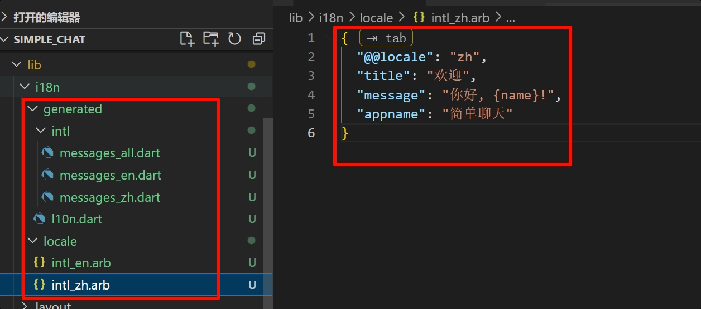

# 初始化 flutter 项⽬

## 创建项⽬

```bash
flutter create {项⽬名称} --org {包名} --platforms {平台} -a {java和kotlin}
```

## 初步整理⽬录

```bash
📂 i18n            国际化
📂 layout          应用框架
📂 models          数据模型
📂 router          路由管理
📂 states          状态管理
📂 theme           主题管理
📂 utils           通用工具
📂 views           视图页面
📂 widgets         通用组件
-  📄main.dart     入口文件
```

## 路由封装

1. 安装依赖

```bash
flutter pub add auto_route
flutter pub add --dev auto_route_generator
```

2. 创建默认 layout 模板 `lib\layout\default.dart`

```dart
import 'package:flutter/material.dart';
import 'package:auto_route/auto_route.dart';

/// DefaultLayout 是应用程序的默认布局组件。
/// 它使用 AutoRouter 来处理路由导航，作为应用程序的主要布局容器。
class DefaultLayout extends StatefulWidget {
  const DefaultLayout({super.key});

  @override
  State<DefaultLayout> createState() => _DefaultLayoutState();
}

class _DefaultLayoutState extends State<DefaultLayout> {
  @override
  Widget build(BuildContext context) {
    return const AutoRouter();
  }
}
```

3. 创建首页视图 `lib\views\home\home_page.dart`

```dart
import 'package:flutter/material.dart';
import 'package:auto_route/auto_route.dart';

@RoutePage()
class HomePage extends StatelessWidget {
  const HomePage({super.key});

  @override
  Widget build(BuildContext context) {
    return const Scaffold(
      // 主轴居中对齐
      body: Center(child: Text('Home Page')),
    );
  }
}
```

4. 生成路由代码

- 使用 [watch] 标志来监视文件系统的编辑并根据需要重建

```bash
dart run build_runner watch
```

- 如果你希望生成器运行一次然后退出，请使用

```bash
dart run build_runner build
```

5. 连接 MaterialApp

```dart
class MyApp extends StatelessWidget {
  MyApp({super.key});

  // 导入路由
  final rootRouter = AppRouter();

  @override
  Widget build(BuildContext context) {
    return MaterialApp.router(
      // 使用路由
      routerConfig: rootRouter.config(),
    );
  }
}
```

## 状态管理封装

1. 安装依赖

```bash
flutter pub add flutter_riverpod
flutter pub add riverpod_annotation
flutter pub add dev:riverpod_generator
flutter pub add dev:build_runner
flutter pub add dev:custom_lint
flutter pub add dev:riverpod_lint
```

2. 运行代码生成器

```bash
dart run build_runner watch
```

3. 启用 riverpod_lint `analysis_options.yaml`

```yaml
analyzer:
  plugins:
    - custom_lint
```

- 手动检查报错

```bash
dart run custom_lint
```

4. 集成 flutter_riverpod

```bash
import 'package:flutter_riverpod/flutter_riverpod.dart';

void main() {
  runApp(
    // 使用ProviderScope包裹MyApp
    ProviderScope(
      child: MyApp(),
    ),
  );
}
```

5. 创建示例状态

```dart
import 'package:flutter/material.dart';
import 'package:flutter_riverpod/flutter_riverpod.dart';
import 'package:riverpod_annotation/riverpod_annotation.dart';

part 'example.g.dart';

@riverpod
class ExampleDataRef extends _$ExampleDataRef {
  @override
  String build() {
    return 'Hello world';
  }

  void update(String newData) {
    state = newData;
  }
}
```

- 执行自动生成

```bash
dart run build_runner build
```

6. 使用状态

- 原生使用

```dart
import 'package:flutter/material.dart';
import 'package:auto_route/auto_route.dart';
import 'package:flutter_riverpod/flutter_riverpod.dart';
import 'package:simple_chat/states/example/example.dart';

/// 继承 ConsumerWidget
@RoutePage()
class HomePage extends ConsumerWidget {
  const HomePage({super.key});

  @override
  Widget build(BuildContext context, WidgetRef ref) {
    /// 通过ref.watch获取exampleDataRefProvider的值
    /// *exampleDataRefProvider是自动生成的
    final String exampleData = ref.watch(exampleDataRefProvider);

    return Scaffold(
      body: Center(
        child: Column(
          children: [
            // 使用exampleData
            Text(exampleData),
          ],
        ),
      ),
    );
  }
}
```

- 自定义封装
- - ExampleDataRef 类添加 value 实现

```dart
@riverpod
class ExampleDataRef extends _$ExampleDataRef {
  /// ...code

  /// 获取值
  static String value(WidgetRef ref) {
    return ref.watch(exampleDataRefProvider);
  }
}
```

- - 使用

```dart
/// 继承 ConsumerWidget
@RoutePage()
class HomePage extends ConsumerWidget {
  const HomePage({super.key});

  @override
  Widget build(BuildContext context, WidgetRef ref) {
    /// 通过ExampleDataRef.value获取值
    final String exampleData = ExampleDataRef.value(ref);
  }
}
```

7. 修改状态

```dart
ref.read(exampleDataRefProvider.notifier).update("Hello Riverpod");
```

- 封装修改状态

```dart
@riverpod   
class ExampleDataRef extends _$ExampleDataRef {
  /// code

  /// 封装设置值函数
  static void setValue(WidgetRef ref, String newData) {
    ref.read(exampleDataRefProvider.notifier).update(newData);
  }
}
```

```dart
onPressed: () {
  // ref.read(exampleDataRefProvider.notifier).update("Hello Riverpod");
  ExampleDataRef.setValue(ref, "Hello Riverpod");
}
```

## 国际化配置

1. 安装依赖

```bash
flutter pub add flutter_localizations --sdk=flutter
flutter pub add intl:any
flutter pub add dev:intl_utils
```

2. 配置生成器

```yaml
# 在 pubspec.yaml 中添加：
# 生成本地化代码 flutter pub run intl_utils:generate
flutter_intl:
  enabled: true
  arb_dir: lib/i18n/locale
  output_dir: lib/i18n/generated
```

- 执行生成后文件格式
  

3. 创建 Locale 状态管理

```dart
// lib\states\locale\locale.dart
import 'package:flutter/material.dart';
import 'package:flutter_riverpod/src/consumer.dart';
import 'package:riverpod_annotation/riverpod_annotation.dart';

part 'locale.g.dart';

@riverpod
class LocaleData extends _$LocaleData {
  @override
  Locale build() {
    return Locale('en');
  }

  /// 更新状态
  void update(Locale newLocale) {
    state = newLocale;
  }

  /// 获取值
  static Locale value(WidgetRef ref) {
    return ref.watch(localeDataProvider);
  }

  /// 设置值
  static void change(WidgetRef ref, Locale newLocale) {
    ref.read(localeDataProvider.notifier).update(newLocale);
  }
}
```

4. 引入 flutter_localizations 库

```bash
import 'package:flutter_localizations/flutter_localizations.dart';
import 'package:simple_chat/states/locale/locale.dart';
import 'package:simple_chat/i18n/generated/l10n.dart';
```

```dart
class MyApp extends ConsumerWidget {
  MyApp({super.key});

  @override
  Widget build(BuildContext context, WidgetRef ref) {
    // 语言
    final appLocale = LocaleData.value(ref);

    return MaterialApp.router(
      // 导入国际化
      localizationsDelegates: [
        GlobalMaterialLocalizations.delegate,
        GlobalWidgetsLocalizations.delegate,
        GlobalCupertinoLocalizations.delegate,
        AppLocalizationDelegate(), // 引入自定义语言
      ],
      // 解析语言回调
      localeResolutionCallback: (Locale? locale, Iterable<Locale> supportedLocales) {
        // 获取系统语言 并从支持的语言中查找 存在则返回
        var result = supportedLocales.where((element) => element.languageCode == locale?.languageCode);
        if (result.isNotEmpty) {
          return locale;
        }

        // 不存在则返回默认语言
        return Locale('en');
      },
      locale: appLocale,
      // 系统语言切换回调
      localeListResolutionCallback: (List<Locale>? locales, Iterable<Locale> supportedLocales) {
        // print('locales:$locales');
        // print('supportLocales:$supportedLocales');
      },
      supportedLocales: [
        Locale('zh'), // Chinese
        Locale('en'), // English
      ],
    );
  }
}
```

5. 使用语言

```dart
import 'package:flutter/material.dart';
import 'package:flutter_riverpod/flutter_riverpod.dart';
import 'package:simple_chat/states/locale/locale.dart';
import 'package:simple_chat/i18n/generated/l10n.dart';

class HomePage extends ConsumerWidget {
  const HomePage({super.key});

  @override
  Widget build(BuildContext context, WidgetRef ref) {
    // 获取国际化
    final loc = S.of(context);

    return Scaffold(
      body: Center(
        child: Column(
          mainAxisAlignment: MainAxisAlignment.center,
          children: [
            ElevatedButton(
              // 使用
              child: Text(loc.message("Yohann")),
              onPressed: () {
                // 通过状态管理切换语言
                LocaleData.change(ref, Locale("zh"));
              },
            ),
          ],
        ),
      ),
    );
  }
}
```

## 主题管理

1. 创建主题文件

```dart
// lib\theme\index_theme.dart
import 'package:flutter/material.dart';
// 以下你配置的全局主题颜色参数
part 'theme_bluegrey.dart';
part 'theme_lightblue.dart';
part 'theme_pink.dart';

Map<String, ThemeData> ThemeMaps = {
  // 蓝色主题
  "bluegrey": themeBlueGrey,
  // 浅蓝色主题
  "lightblue": themeLightBlue,
  // 粉色主题
  "pink": themePink,
};
```

```dart
// lib\theme\theme_bluegrey.dart
part of 'index_theme.dart';

final ThemeData themeBlueGrey = ThemeData(
  /// ...
);
```

2. 创建主题状态

```dart
import 'package:flutter/material.dart';
import 'package:flutter_riverpod/src/consumer.dart';
import 'package:riverpod_annotation/riverpod_annotation.dart';
import 'package:simple_chat/theme/index_theme.dart';

part 'theme.g.dart';

@riverpod
class ThemeStore extends _$ThemeStore {
  @override
  ThemeData build() {
    /// TODO: 后续可能需要从本地缓存获取历史值
    return themeBlueGrey;
  }

  /// 更新状态
  void update(ThemeData newTheme) {
    state = newTheme;
  }

  /// 获取值
  static ThemeData value(WidgetRef ref) {
    return ref.watch(themeStoreProvider);
  }

  /// 设置值
  static void change(WidgetRef ref, ThemeData newTheme) {
    ref.read(themeStoreProvider.notifier).update(newTheme);
  }
}
```

3. 使用主题

```dart
import 'package:flutter_riverpod/flutter_riverpod.dart';
import 'package:flutter/material.dart';
import 'package:simple_chat/states/theme/theme.dart';

class MyApp extends ConsumerWidget {
  MyApp({super.key});

  @override
  Widget build(BuildContext context, WidgetRef ref) {
    final appTheme = ThemeStore.value(ref);

    return MaterialApp.router(
      // 使用主题
      theme: appTheme,
    );
  }
}
```

## 本地存储

1. 下载依赖

```bash
flutter pub add shared_preferences
```

2. 封装

```dart
import 'package:flutter/material.dart';
import 'package:shared_preferences/shared_preferences.dart';
import 'package:simple_chat/theme/index_theme.dart';

class Store {
  // 缓存实例  初始化时设置 全局调用
  static late SharedPreferences prefs;

  // 语言标识
  static String localeName = "en";
  static Locale locale = Locale('en');

  // 主题标识
  static String themeName = "bluegrey";
  static ThemeData theme = ThemeMaps["bluegrey"]!;

  // 初始化
  static Future<void> init() async {
    // 创建实例
    prefs = await SharedPreferences.getInstance();
    // 获取语言标识
    localeName = prefs.getString("localeName") ?? "en";
    locale = Locale(localeName);
    // 获取主题标识
    themeName = prefs.getString("themeName") ?? "bluegrey";
    theme = ThemeMaps[themeName] ?? ThemeMaps["bluegrey"]!;
  }

  // 是否提前读取主题缓存
  static bool preRead = false;
}
```

3. 初始化

```dart

import 'package:simple_chat/utils/store.dart';

void main() async {
  // 初始缓存
  await Store.init();
}
```
